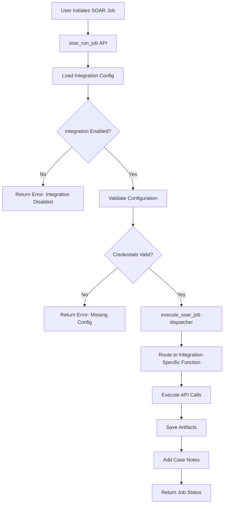

# IRIS SOAR Integration System Architecture & Development Guide

## Table of Contents
- [Overview](#overview)
- [System Architecture](#system-architecture)
- [File Structure](#file-structure)
- [Integration Configuration System](#integration-configuration-system)
- [SOAR Execution Pipeline](#soar-execution-pipeline)
- [Adding New Integrations](#adding-new-integrations)
- [API Patterns & Standards](#api-patterns--standards)
- [Database Schema](#database-schema)
- [Template System](#template-system)
- [Error Handling](#error-handling)
- [Testing & Validation](#testing--validation)

## Overview

The IRIS SOAR (Security Orchestration, Automation, and Response) system provides a standardized framework for integrating third-party security tools and automating incident response actions. The system is designed with modularity, security, and extensibility in mind.

### Current Integrations
- **SentinelOne**: Endpoint Detection and Response (4 playbooks)
- **Velociraptor**: Digital Forensics and Incident Response (1 playbook)

### Core Principles
1. **Configuration-driven**: All integrations are controlled via database-stored configurations
2. **Template-based**: Playbooks follow standardized template patterns
3. **Permission-gated**: Enable/disable controls at integration level
4. **Case-integrated**: All actions tie back to IRIS case management
5. **Audit-ready**: Full logging and artifact preservation

## System Architecture

```
┌─────────────────────────────────────────────────────────────────┐
│                        IRIS Web Frontend                        │
├─────────────────────────────────────────────────────────────────┤
│ ┌─────────────────┐ ┌─────────────────┐ ┌─────────────────────┐ │
│ │   SOAR UI       │ │ Integration     │ │   Documentation     │ │
│ │   Interface     │ │ Management UI   │ │   Pages            │ │
│ └─────────────────┘ └─────────────────┘ └─────────────────────┘ │
├─────────────────────────────────────────────────────────────────┤
│                        Flask Blueprints                        │
├─────────────────────────────────────────────────────────────────┤
│ ┌─────────────────┐ ┌─────────────────┐ ┌─────────────────────┐ │
│ │ soar_routes.py  │ │manage_integra-  │ │  overview_routes    │ │
│ │ • Templates API │ │tions_routes.py  │ │  • Documentation    │ │
│ │ • Job Execution │ │ • Config CRUD   │ │  • Help Pages       │ │
│ │ • Status Query  │ │ • Test Conn.    │ │                     │ │
│ └─────────────────┘ └─────────────────┘ └─────────────────────┘ │
├─────────────────────────────────────────────────────────────────┤
│                     Integration Layer                          │
├─────────────────────────────────────────────────────────────────┤
│ ┌─────────────────┐ ┌─────────────────┐ ┌─────────────────────┐ │
│ │ Integration     │ │ Template        │ │ Execution Engine    │ │
│ │ Config System   │ │ Registry        │ │ • Auth & Headers    │ │
│ │ • Enable/Disable│ │ • ID Mapping    │ │ • API Calls         │ │
│ │ • Credentials   │ │ • Validation    │ │ • Error Handling    │ │
│ └─────────────────┘ └─────────────────┘ └─────────────────────┘ │
├─────────────────────────────────────────────────────────────────┤
│                      External APIs                             │
├─────────────────────────────────────────────────────────────────┤
│ ┌─────────────────┐ ┌─────────────────┐ ┌─────────────────────┐ │
│ │ SentinelOne     │ │ Velociraptor    │ │ Future              │ │
│ │ REST API        │ │ REST API        │ │ Integrations        │ │
│ └─────────────────┘ └─────────────────┘ └─────────────────────┘ │
└─────────────────────────────────────────────────────────────────┘
```

## File Structure

### Core Files

```
source/app/
├── blueprints/
│   ├── soar/
│   │   ├── soar_routes.py                 # Main SOAR execution engine
│   │   └── templates/
│   │       └── soar.html                  # SOAR UI interface
│   │
│   ├── manage/
│   │   └── manage_integrations/
│   │       ├── manage_integrations_routes.py   # Config management
│   │       └── templates/
│   │           └── manage_integrations.html    # Config UI
│   │
│   └── overview/
│       ├── overview_routes.py             # Documentation routes
│       └── templates/
│           └── overview_docs.html         # Integration docs
│
├── models/
│   └── integrations.py                    # Database models
│
├── alembic/versions/
│   └── 0d65689ff494_*.py                 # Database migration
│
└── views.py                              # Blueprint registration
```

### Key Functions by File

#### `soar_routes.py` (1,148 lines)
- **Main Functions**:
  - `soar_index()` - SOAR UI page
  - `soar_templates_list()` - Available templates API
  - `soar_run_job()` - Execute playbook
  - `execute_soar_job()` - Main execution dispatcher

- **Integration Executors**:
  - `execute_sentinelone_quarantine()`
  - `execute_sentinelone_fetch_apps()`
  - `execute_sentinelone_full_scan()`
  - `execute_velociraptor_collect()`

- **Utility Functions**:
  - `get_template_name()` - Template ID to display name mapping
  - `create_case_artifact_folder()` - File system setup
  - `save_case_artifact()` - Evidence preservation
  - `add_case_note()` - Case timeline updates

#### `manage_integrations_routes.py`
- **Configuration Functions**:
  - `manage_integrations_index()` - Management UI
  - `get_integrations_config()` - Config retrieval
  - `save_integrations_config()` - Config persistence
  - `test_sentinelone_connection()` - Connectivity validation
  - `test_velociraptor_connection()` - Connectivity validation

## Integration Configuration System

### Database Model (`integrations.py`)

```python
class IntegrationConfig(db.Model):
    __tablename__ = 'integration_config'

    config_id = Column(Integer, primary_key=True)
    integration_type = Column(String(50), nullable=False, unique=True)
    enabled = Column(Boolean, nullable=False, default=False)  # CRITICAL: Enable/disable control
    config_data = Column(JSONB, nullable=True)               # Credentials & settings
    created_at = Column(DateTime(timezone=True), server_default=func.now())
    updated_at = Column(DateTime(timezone=True), onupdate=func.now())
    created_by = Column(String(255), nullable=True)
    updated_by = Column(String(255), nullable=True)
    description = Column(Text, nullable=True)
```

### Configuration Structure

Each integration follows this JSON schema in `config_data`:

#### SentinelOne Configuration
```json
{
  "base_url": "https://console.sentinelone.net",
  "api_token": "eyJ...",
  "site_id": "1234567890",
  "verify_ssl": true
}
```

#### Velociraptor Configuration
```json
{
  "base_url": "https://velociraptor.example.com:8000",
  "api_key": "api_key_here",
  "ca_cert": "-----BEGIN CERTIFICATE-----\n...",
  "verify_ssl": true
}
```

### Default Configuration Provider

The `get_integrations_config()` function provides fail-safe defaults:

```python
default_configs = {
    'velociraptor': {
        'enabled': False,
        'base_url': '',
        'api_key': '',
        'ca_cert': '',
        'verify_ssl': True
    },
    'sentinelone': {
        'enabled': False,
        'base_url': '',
        'api_token': '',
        'verify_ssl': True,
        'site_id': ''
    }
}
```

## SOAR Execution Pipeline

### 1. Template Registration System

Templates are registered in `soar_routes.py` at line 74-142:

```python
def soar_templates_list():
    templates = [
        {
            "id": "sentinel1-quarantine",               # Template identifier
            "name": "SentinelOne Network Quarantine",   # Display name
            "description": "Isolate an endpoint...",    # User description
            "vendor": "SentinelOne",                    # Integration vendor
            "tags": ["containment", "isolation"],       # Capability tags
            "requires_approval": True,                   # Permission level
            "allowed_target_types": ["agent_id", "hostname"],  # Input types
            "created_by": "system",
            "created_at": "2025-10-13T00:00:00Z"
        }
        # ... more templates
    ]
```

### 2. Job Execution Flow



### 3. Authorization Gating

**Critical Security Check** (line 323-332):
```python
if not config.get('enabled', False):
    return {
        "job_id": job_id,
        "status": "Failed",
        "message": f"{integration_type.capitalize()} integration is not enabled - Please configure it in Manage > Integrations",
        "error": "Integration disabled - API credentials required"
    }
```

This check **PREVENTS ALL EXECUTION** if the integration toggle is disabled.

### 4. Integration Routing Logic

```python
def execute_soar_job(job_id, template_id, target, case_id, integrations_config):
    # Determine integration from template ID prefix
    if template_id.startswith('sentinel'):
        integration_type = 'sentinelone'
        config = integrations_config.get('sentinelone', {})
    elif template_id.startswith('velociraptor'):
        integration_type = 'velociraptor'
        config = integrations_config.get('velociraptor', {})

    # Route to specific execution function
    if template_id == 'sentinel1-quarantine':
        return execute_sentinelone_quarantine(job_id, target, config, case_id)
    elif template_id == 'sentinel1-fetch-apps':
        return execute_sentinelone_fetch_apps(job_id, target, config, case_id)
    # ... etc
```

## Adding New Integrations

### Step 1: Database Configuration

1. **Add default configuration** in `get_integrations_config()`:
```python
default_configs = {
    # existing configs...
    'new_integration': {
        'enabled': False,
        'base_url': '',
        'api_key': '',
        'verify_ssl': True,
        # add integration-specific fields
    }
}
```

### Step 2: UI Configuration

1. **Add integration card** in `manage_integrations.html`:
```html
<!-- New Integration Card -->
<div class="integration-card">
    <div class="integration-header">
        <div class="d-flex align-items-center justify-content-between">
            <div class="d-flex align-items-center">
                <i class="fas fa-shield-alt new-integration-icon integration-icon"></i>
                <div>
                    <h5 class="mb-1">New Integration</h5>
                    <small class="text-muted">Description of integration capabilities</small>
                </div>
            </div>
            <div>
                <span class="status-badge status-enabledstatus-disabled">
                    EnabledDisabled
                </span>
            </div>
        </div>
    </div>
    <div class="integration-body">
        <form id="new-integration-form">
            <!-- Enable/Disable Toggle -->
            <div class="col-md-6">
                <div class="form-group">
                    <label>Enable Integration</label>
                    <div class="toggle-container">
                        <div class="custom-control custom-switch">
                            <input type="checkbox" class="custom-control-input" id="ni-enabled"
                                   checked>
                            <label class="custom-control-label" for="ni-enabled">
                                <span class="switch-text">Enable New Integration</span>
                            </label>
                        </div>
                    </div>
                </div>
            </div>

            <!-- Configuration Fields -->
            <div class="col-md-6">
                <div class="form-group">
                    <label for="ni-base-url">API Base URL <span class="text-danger">*</span></label>
                    <input type="url" class="form-control" id="ni-base-url"
                           placeholder="https://api.newintegration.com"
                           value="{{ integrations.new_integration.base_url }}">
                </div>
            </div>

            <!-- Add more fields as needed -->

            <!-- Action Buttons -->
            <div class="col-md-6">
                <div class="form-group">
                    <button type="button" class="btn btn-info btn-sm" onclick="testConnection('new_integration')">
                        <i class="fas fa-plug mr-1"></i>Test Connection
                    </button>
                    <button type="button" class="btn btn-success btn-sm ml-2" onclick="saveConfig('new_integration')">
                        <i class="fas fa-save mr-1"></i>Save Configuration
                    </button>
                </div>
            </div>
        </form>
    </div>
</div>
```

2. **Update JavaScript configuration handler**:
```javascript
function getConfigFromForm(integrationType) {
    // existing cases...
    } else if (integrationType === 'new_integration') {
        return {
            enabled: document.getElementById('ni-enabled').checked,
            base_url: document.getElementById('ni-base-url').value,
            api_key: document.getElementById('ni-api-key').value,
            // add other fields
        };
    }
}
```

### Step 3: Connection Testing

Add test function in `manage_integrations_routes.py`:

```python
def test_new_integration_connection(config):
    """
    Test New Integration connection
    """
    try:
        base_url = config.get('base_url')
        api_key = config.get('api_key')

        if not base_url or not api_key:
            return {'success': False, 'message': 'Missing required configuration'}

        # Implement connection test logic
        headers = {'Authorization': f'Bearer {api_key}'}
        response = requests.get(f'{base_url}/api/health', headers=headers, timeout=10)

        if response.status_code == 200:
            return {
                'success': True,
                'message': 'Connection test successful',
                'server_version': response.json().get('version', 'Unknown'),
                'response_time': f'{response.elapsed.total_seconds()*1000:.0f}ms'
            }
        else:
            return {'success': False, 'message': f'API returned status {response.status_code}'}

    except Exception as e:
        return {'success': False, 'message': f'Connection failed: {str(e)}'}
```

Update the test router:
```python
def test_integration_connection():
    # existing code...
    elif integration_type == 'new_integration':
        result = test_new_integration_connection(config)
    # existing code...
```

### Step 4: Template Registration

Add templates to `soar_templates_list()`:

```python
{
    "id": "new_integration-action1",
    "name": "New Integration Action 1",
    "description": "Description of what this action does",
    "vendor": "New Integration",
    "tags": ["category1", "category2"],
    "requires_approval": False,
    "allowed_target_types": ["hostname", "ip_address"],
    "created_by": "system",
    "created_at": "2025-10-15T00:00:00Z"
}
```

Add to template name mapping:
```python
def get_template_name(template_id):
    template_names = {
        # existing mappings...
        'new_integration-action1': 'New Integration Action 1',
        'new_integration-action2': 'New Integration Action 2',
    }
```

### Step 5: Execution Functions

Add routing in `execute_soar_job()`:

```python
def execute_soar_job(job_id, template_id, target, case_id, integrations_config):
    # existing routing...
    elif template_id.startswith('new_integration'):
        integration_type = 'new_integration'
        config = integrations_config.get('new_integration', {})

    # execution routing...
    elif template_id == 'new_integration-action1':
        return execute_new_integration_action1(job_id, target, config, case_id)
```

Create execution functions:

```python
def execute_new_integration_action1(job_id, target, config, case_id):
    """
    Execute New Integration Action 1
    """
    try:
        # Extract configuration
        base_url = config.get('base_url').rstrip('/')
        api_key = config.get('api_key')
        verify_ssl = config.get('verify_ssl', True)

        # Set up authentication headers
        headers = {
            'Authorization': f'Bearer {api_key}',
            'Content-Type': 'application/json'
        }

        # Step 1: Validate target (if needed)
        # ... target validation logic

        # Step 2: Execute API call
        endpoint = f'{base_url}/api/v1/action1'
        payload = {
            'target': target,
            'action': 'specific_action',
            # add other required parameters
        }

        response = requests.post(endpoint, headers=headers, json=payload,
                               verify=verify_ssl, timeout=30)

        if response.status_code != 200:
            return {
                "job_id": job_id,
                "status": "Failed",
                "message": f"API call failed: {response.status_code}",
                "error": response.text
            }

        result_data = response.json()

        # Step 3: Save artifacts (if applicable)
        artifact_path = create_case_artifact_folder(case_id)
        if artifact_path:
            artifact_file = f"new_integration_action1_{job_id}.json"
            save_case_artifact(case_id, artifact_file, result_data)

        # Step 4: Add case note
        note_content = f"""
**New Integration Action 1 Executed**

**Target:** {target}
**Status:** Success
**Job ID:** {job_id}
**Timestamp:** {datetime.now().strftime('%Y-%m-%d %H:%M:%S UTC')}

**Result Summary:**
- Action completed successfully
- Result details saved as artifact: {artifact_file}

**API Response:** Status {response.status_code}
        """
        add_case_note(case_id, note_content)

        return {
            "job_id": job_id,
            "status": "Completed",
            "message": "Action 1 executed successfully",
            "artifacts": [artifact_file] if artifact_path else [],
            "details": {
                "target": target,
                "execution_time": response.elapsed.total_seconds(),
                "api_status": response.status_code
            }
        }

    except requests.exceptions.RequestException as e:
        error_msg = f"Network error executing action: {str(e)}"
        add_case_note(case_id, f"**New Integration Action 1 Failed**\n\nError: {error_msg}")

        return {
            "job_id": job_id,
            "status": "Failed",
            "message": error_msg,
            "error": str(e)
        }

    except Exception as e:
        error_msg = f"Unexpected error: {str(e)}"
        add_case_note(case_id, f"**New Integration Action 1 Failed**\n\nError: {error_msg}")

        return {
            "job_id": job_id,
            "status": "Failed",
            "message": error_msg,
            "error": str(e)
        }
```

### Step 6: Documentation

Add integration documentation to `overview_docs.html`:

```html
<!-- New Integration Tab -->
<div class="tab-pane fade" id="new-integration" role="tabpanel">
    <div class="integration-card">
        <div class="integration-header new-integration">
            <h3><i class="fas fa-shield-alt mr-2"></i>New Integration</h3>
            <p class="mb-0">Description of the integration capabilities</p>
        </div>
        <div class="card-body">
            <h5><i class="fas fa-info-circle text-primary mr-2"></i>About New Integration</h5>
            <p>Detailed description of what this integration provides...</p>

            <h5 class="mt-4"><i class="fas fa-cog text-secondary mr-2"></i>Configuration Requirements</h5>
            <ul>
                <li><strong>API Base URL:</strong> Your instance base URL</li>
                <li><strong>API Key:</strong> Valid API key with required permissions</li>
                <li><strong>Required Permissions:</strong> List specific permissions needed</li>
            </ul>

            <h5 class="mt-4"><i class="fas fa-play-circle text-success mr-2"></i>Available SOAR Playbooks</h5>

            <!-- Document each playbook -->
            <div class="playbook-item forensics">
                <div class="row">
                    <div class="col-md-8">
                        <h6><i class="fas fa-search mr-2"></i>Action 1 Name</h6>
                        <p class="mb-2">Description of what this action does.</p>
                        <div>
                            <span class="badge badge-success badge-custom">category</span>
                        </div>
                    </div>
                    <div class="col-md-4 text-right">
                        <small class="text-muted">Template ID:</small><br>
                        <code>new_integration-action1</code>
                    </div>
                </div>
                <div class="mt-3">
                    <strong>What it does:</strong>
                    <ol class="mt-2 mb-2">
                        <li>Step 1 description</li>
                        <li>Step 2 description</li>
                        <!-- etc -->
                    </ol>
                    <strong>Use Cases:</strong> List relevant use cases
                </div>
            </div>
        </div>
    </div>
</div>
```

## API Patterns & Standards

### Authentication Patterns

**SentinelOne Pattern:**
```python
headers = {
    'Authorization': f'ApiToken {api_token}',
    'Content-Type': 'application/json'
}
```

**Velociraptor Pattern:**
```python
headers = {
    'Authorization': f'Bearer {api_key}',
    'Content-Type': 'application/json'
}
```

### Standard Request Pattern

```python
def execute_integration_action(job_id, target, config, case_id):
    try:
        # 1. Extract and validate configuration
        base_url = config.get('base_url').rstrip('/')
        api_key = config.get('api_key')
        verify_ssl = config.get('verify_ssl', True)

        if not base_url or not api_key:
            return {
                "job_id": job_id,
                "status": "Failed",
                "message": "Missing required configuration",
                "error": "API credentials not configured"
            }

        # 2. Set up authentication
        headers = {'Authorization': f'Bearer {api_key}'}

        # 3. Execute API call with error handling
        response = requests.post(endpoint, headers=headers, json=payload,
                               verify=verify_ssl, timeout=30)

        if response.status_code != 200:
            return {
                "job_id": job_id,
                "status": "Failed",
                "message": f"API error: {response.status_code}",
                "error": response.text
            }

        # 4. Process response
        result = response.json()

        # 5. Save artifacts
        artifact_file = f"integration_action_{job_id}.json"
        save_case_artifact(case_id, artifact_file, result)

        # 6. Add case note
        add_case_note(case_id, f"Action completed successfully. Artifact: {artifact_file}")

        # 7. Return standardized response
        return {
            "job_id": job_id,
            "status": "Completed",
            "message": "Action executed successfully",
            "artifacts": [artifact_file],
            "details": {"execution_time": response.elapsed.total_seconds()}
        }

    except requests.exceptions.RequestException as e:
        # Network/HTTP errors
        return {"job_id": job_id, "status": "Failed", "message": str(e)}
    except Exception as e:
        # Unexpected errors
        return {"job_id": job_id, "status": "Failed", "message": str(e)}
```

### Response Standardization

All execution functions MUST return this structure:

```python
{
    "job_id": str,           # Unique job identifier
    "status": str,           # "Completed", "Failed", "Running"
    "message": str,          # Human-readable status message
    "error": str,            # Error details (optional, for failures)
    "artifacts": List[str],  # List of saved artifact filenames (optional)
    "details": dict          # Additional execution details (optional)
}
```

### Error Handling Standards

1. **Configuration Errors**: Missing or invalid credentials
2. **Network Errors**: Connection timeouts, DNS failures
3. **API Errors**: HTTP error status codes, authentication failures
4. **Data Errors**: Invalid responses, missing expected fields
5. **System Errors**: File system issues, unexpected exceptions

Each error type should return appropriate status and error messages.

## Database Schema

### Integration Configuration Table

```sql
CREATE TABLE integration_config (
    config_id SERIAL PRIMARY KEY,
    integration_type VARCHAR(50) NOT NULL UNIQUE,
    enabled BOOLEAN NOT NULL DEFAULT FALSE,
    config_data JSONB,
    created_at TIMESTAMP WITH TIME ZONE DEFAULT NOW(),
    updated_at TIMESTAMP WITH TIME ZONE DEFAULT NOW(),
    created_by VARCHAR(255),
    updated_by VARCHAR(255),
    description TEXT
);

CREATE INDEX ix_integration_config_type ON integration_config (integration_type);
```

### Migration Template

For new integrations, create an Alembic migration:

```python
"""Add [integration_name] to integration_config

Revision ID: [auto_generated]
Revises: [previous_revision]
Create Date: [timestamp]
"""
from alembic import op
import sqlalchemy as sa

def upgrade():
    # Insert default configuration for new integration
    op.execute("""
        INSERT INTO integration_config (integration_type, enabled, config_data, created_by)
        VALUES ('new_integration', FALSE, '{"base_url": "", "api_key": "", "verify_ssl": true}', 'system')
        ON CONFLICT (integration_type) DO NOTHING;
    """)

def downgrade():
    # Remove integration configuration
    op.execute("DELETE FROM integration_config WHERE integration_type = 'new_integration';")
```

## Template System

### Template ID Conventions

- Format: `{integration}-{action}`
- Examples:
  - `sentinel1-quarantine`
  - `velociraptor-collect`
  - `new_integration-action1`

### Template Properties

```python
{
    "id": str,                    # Unique identifier (routing key)
    "name": str,                  # Display name for UI
    "description": str,           # User-facing description
    "vendor": str,                # Integration vendor name
    "tags": List[str],           # Capability categories
    "requires_approval": bool,    # Permission escalation flag
    "allowed_target_types": List[str],  # Valid input types
    "created_by": str,           # Creator identification
    "created_at": str            # ISO timestamp
}
```

### Tag Categories

Standard tag categories for organization:

- **containment**: Isolation, quarantine, blocking actions
- **forensics**: Evidence collection, data gathering
- **inventory**: Asset discovery, software listing
- **logs**: Log collection and analysis
- **scanning**: Vulnerability or malware scanning
- **triage**: Initial assessment actions

## Error Handling

### Error Response Format

```python
{
    "job_id": str,
    "status": "Failed",
    "message": str,     # User-friendly error message
    "error": str        # Technical error details
}
```

### Common Error Scenarios

1. **Integration Disabled**
   ```python
   {
       "job_id": job_id,
       "status": "Failed",
       "message": "SentinelOne integration is not enabled - Please configure it in Manage > Integrations",
       "error": "Integration disabled - API credentials required"
   }
   ```

2. **Missing Configuration**
   ```python
   {
       "job_id": job_id,
       "status": "Failed",
       "message": "Integration not configured properly",
       "error": "Missing required fields: base_url, api_token"
   }
   ```

3. **API Failure**
   ```python
   {
       "job_id": job_id,
       "status": "Failed",
       "message": "Failed to execute action on target",
       "error": "SentinelOne API returned status 401: Unauthorized"
   }
   ```

4. **Target Not Found**
   ```python
   {
       "job_id": job_id,
       "status": "Failed",
       "message": "Target not found: hostname123",
       "error": "No agents found matching the target hostname"
   }
   ```

### Logging Strategy

- **Debug logs**: API request/response details
- **Info logs**: Job start/completion status
- **Error logs**: Failures with full stack traces
- **Audit logs**: Configuration changes, job executions

## Testing & Validation

### Connection Testing

Each integration must implement a connection test function:

```python
def test_integration_connection(config):
    """Test integration connectivity and credentials"""
    try:
        # Validate required fields
        required_fields = ['base_url', 'api_key']
        missing_fields = [f for f in required_fields if not config.get(f)]
        if missing_fields:
            return {
                'success': False,
                'message': f'Missing required fields: {", ".join(missing_fields)}'
            }

        # Test API connectivity
        response = requests.get(f'{config["base_url"]}/health',
                              headers={'Authorization': f'Bearer {config["api_key"]}'})

        if response.status_code == 200:
            return {
                'success': True,
                'message': 'Connection test successful',
                'response_time': f'{response.elapsed.total_seconds()*1000:.0f}ms'
            }
        else:
            return {
                'success': False,
                'message': f'API returned status {response.status_code}'
            }

    except Exception as e:
        return {'success': False, 'message': f'Connection failed: {str(e)}'}
```

### Integration Checklist

Before deploying a new integration, verify:

- [ ] **Configuration UI**: Toggle switch, required fields, validation
- [ ] **Connection Testing**: Successful authentication test
- [ ] **Template Registration**: All playbooks appear in UI
- [ ] **Execution Functions**: All templates route to working functions
- [ ] **Error Handling**: Graceful failure for all error conditions
- [ ] **Artifact Storage**: Results saved to case files appropriately
- [ ] **Case Notes**: Timeline entries created for all actions
- [ ] **Documentation**: Integration documented in overview page
- [ ] **Database Migration**: Default config added via migration
- [ ] **Authorization**: Enable/disable controls work correctly

### Security Considerations

1. **Credential Storage**: Never log API keys or tokens
2. **SSL Verification**: Default to `verify_ssl: true`
3. **Input Validation**: Sanitize all user-provided targets
4. **Permission Checks**: Respect `requires_approval` flags
5. **Audit Logging**: Log all configuration changes and job executions
6. **Error Information**: Don't expose sensitive data in error messages

## Dependencies

### Python Packages Required

```python
# Core Flask framework
from flask import Blueprint, render_template, request, jsonify

# HTTP client for API calls
import requests

# Standard library
import json
import uuid
import time
import os
import traceback
from datetime import datetime

# Database ORM
from app import db
from app.models.integrations import IntegrationConfig

# IRIS-specific utilities
from app.util import response_success, response_error
from app.datamgmt.case.case_db import get_case
```

### External API Requirements

Each integration requires:
- Valid API endpoint URLs
- Authentication credentials (tokens, keys)
- Network connectivity from IRIS server
- Appropriate API permissions for target actions

---

## Summary

The IRIS SOAR integration system provides a robust, extensible framework for adding security tool integrations. The key architectural principles are:

1. **Database-driven configuration** with enable/disable controls
2. **Template-based execution** with standardized routing
3. **Artifact preservation** and case timeline integration
4. **Comprehensive error handling** and user feedback
5. **Security-first design** with credential protection

Following the patterns established by SentinelOne and Velociraptor integrations ensures consistency, maintainability, and reliability across all integrations. The modular design allows for independent development and deployment of new integrations without affecting existing functionality.

For questions or clarification on any aspect of the integration system, refer to the existing implementations in `soar_routes.py` as reference examples.